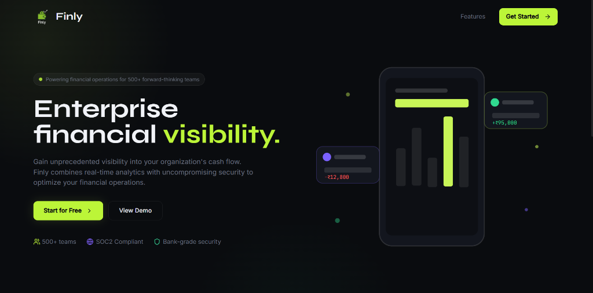
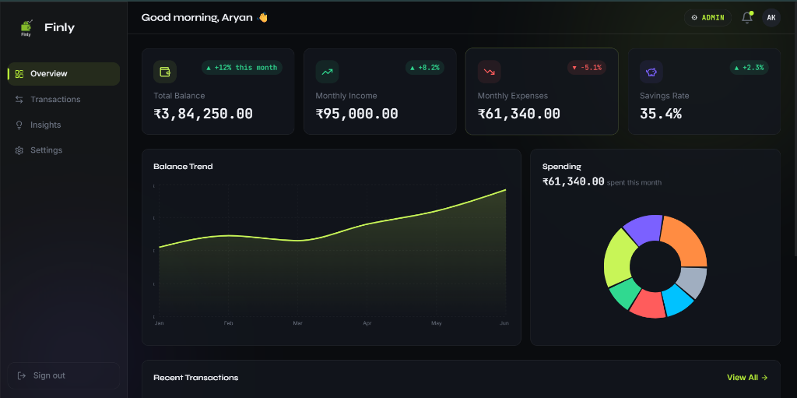
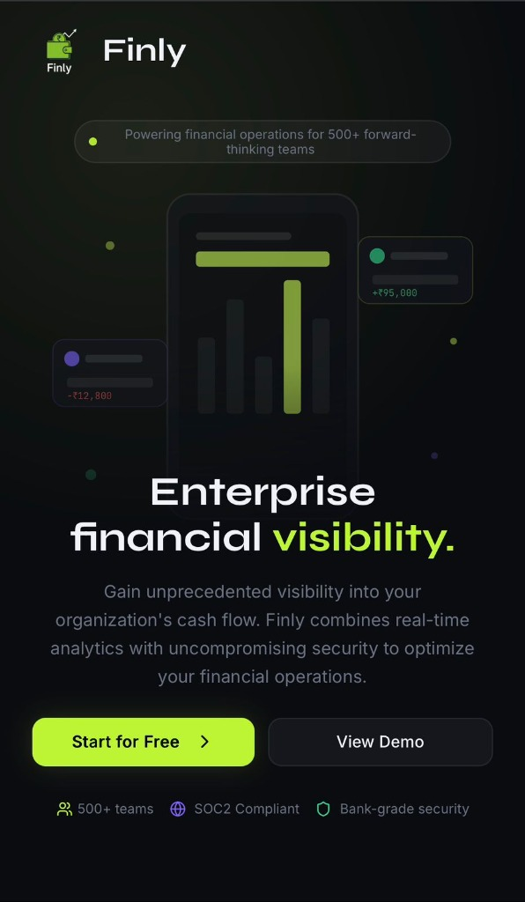
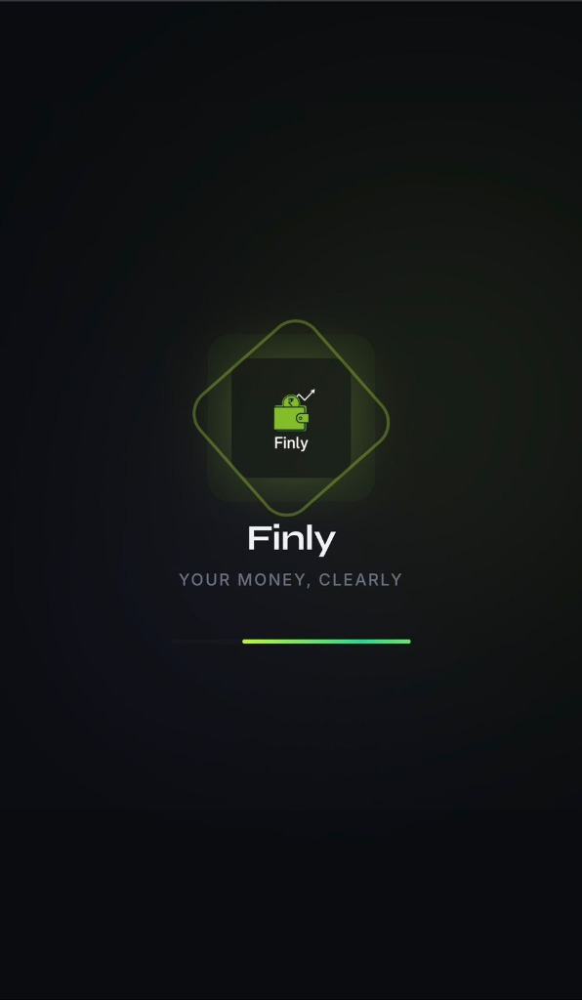

# Finly — Your Money, Clearly.

A modern, dark-themed personal finance dashboard built for young Indian professionals. Track expenses, visualize spending patterns, manage transactions, and gain actionable insights — all denominated in ₹ INR.

> **Live Demo:** [Deploy URL here]  
> **Built with:** React 18 · TypeScript · Tailwind CSS · Recharts · Framer Motion

## Screenshots

### Desktop — Landing Page


### Desktop — Dashboard


### Mobile — Landing & Preloader
<p float="left">
  
  
</p>

---

## Table of Contents

- [Features](#features)
- [Tech Stack](#tech-stack)
- [Getting Started](#getting-started)
- [Project Structure](#project-structure)
- [Design Approach](#design-approach)
- [State Management](#state-management)
- [Role-Based Access (RBAC)](#role-based-access-rbac)
- [Responsiveness](#responsiveness)
- [Optional Enhancements Implemented](#optional-enhancements-implemented)

---

## Features

### 1. Dashboard Overview
- **Summary Cards** — Total Balance, Monthly Income, Monthly Expenses, Savings Rate with trend indicators and color-coded icons.
- **Balance Trend Chart** — Time-based area chart showing balance progression over 6 months (Recharts).
- **Spending Donut Chart** — Category-wise breakdown of expenses with interactive hover states.
- **Recent Transactions** — Quick-glance list of the 5 latest transactions with category badges and formatted amounts.
- **Insight Banner** — Contextual spending alert at the bottom of the dashboard.

### 2. Transactions Section
- Full transaction table with **Date, Description, Category, Type, Amount, Status** columns.
- **Search** — Real-time search by description with a dedicated search input.
- **Category filter** — dropdown for all 8 categories.
- **Type filter** — Income / Expense toggle.
- **Sort options** — Newest first, Oldest first, Amount High→Low, Amount Low→High.
- **Add Transaction** — Modal form with validation (Admin only).
- **Edit Transaction** — Slide-out drawer for inline editing (Admin only).
- **Delete Transaction** — Confirmation dialog with undo pattern (Admin only).
- **Export** — CSV and JSON export (Admin only).
- **Empty State** — Graceful UI when no transactions match filters, with a "Reset Filters" action.

### 3. Insights Section
- **Top Spending Category** — Horizontal bar chart ranking categories by spend.
- **Month-over-Month Comparison** — Grouped bar chart comparing two months.
- **Spending Velocity** — Daily spending pattern visualization.
- **Savings Goal Tracker** — Radial progress ring showing progress toward a ₹5,00,000 goal.
- **Budget Alert** — Warning card when a category exceeds its monthly budget.
- **Best Month** — Highlights the lowest spending month with a large formatted amount.

### 4. Settings & Profile
- **Editable Profile** — Name field is editable; Gmail address is read-only.
- **Notification Toggles** — Gmail notifications, budget alerts, weekly summary (interactive toggle switches).
- **Data Management** — "Clear All Data" restricted to Admin role.
- **Mobile Sign Out** — Dedicated sign-out button in Settings on mobile devices.
- **Desktop Sign Out** — Located in the sidebar footer on desktop.

### 5. Role-Based Access Control (RBAC)
- Two roles: **Admin** and **Viewer**, toggled via a pill button in the top navigation.
- Role persists across sessions via `localStorage`.
- **Admin** — Full access: add, edit, delete transactions, export data, clear data.
- **Viewer** — Read-only: can browse all data but cannot modify or export.
- UI elements (buttons, actions) conditionally render based on the active role.

### 6. Landing & Auth Pages
- **Landing Page** — Premium SaaS-style landing with hero section, animated SVG illustration, feature cards, social proof carousel, and footer.
- **Auth Pages** — Login and Sign Up with Google OAuth mock, form validation, and role selection for signup.

---

## Tech Stack

| Layer | Technology |
|---|---|
| Framework | React 18 + TypeScript |
| Build Tool | Vite 5 (SWC) |
| Styling | Tailwind CSS 3 + custom CSS design system |
| Charts | Recharts |
| Animations | Framer Motion |
| Icons | Lucide React |
| UI Primitives | Radix UI (via shadcn/ui) |
| State | React Context + useReducer |
| Routing | React Router v6 |
| Notifications | Sonner (toast) |
| Typography | Syne (headings) · Inter (body) · JetBrains Mono (numbers) |
| Data | Mock static data with localStorage persistence |

---

## Getting Started

### Prerequisites

- **Node.js** ≥ 18
- **npm** ≥ 9 (or yarn/pnpm/bun)

### Installation

```bash
# Clone the repository
git clone https://github.com/your-username/finly-your-money-clearly.git
cd finly-your-money-clearly

# Install dependencies
npm install

# Start development server
npm run dev
```

The app will be available at `http://localhost:8080`.

### Build for Production

```bash
npm run build
npm run preview
```

---

## Project Structure

```
src/
├── components/
│   ├── layout/          # Layout shell — Sidebar, TopNav, BottomNav
│   ├── shared/          # Reusable components — EmptyState
│   ├── ui/              # Radix UI primitives (shadcn/ui)
│   └── Preloader.tsx    # App boot animation
├── context/
│   └── RoleContext.tsx   # Global role state (Admin/Viewer)
├── features/
│   ├── dashboard/
│   │   └── components/  # SummaryCard, BalanceTrendChart, SpendingDonutChart
│   ├── insights/
│   │   └── components/  # CategoryBarChart, MonthCompareChart, SpendingVelocity, SavingsRing
│   └── transactions/
│       ├── components/  # AddTransactionModal, EditTransactionDrawer
│       ├── context/     # TransactionContext (useReducer + localStorage)
│       └── data/        # mockTransactions.ts — 30 entries with categories
├── lib/
│   ├── dateUtils.ts     # Date formatting + greeting logic
│   ├── exportUtils.ts   # CSV/JSON export helpers
│   ├── formatCurrency.ts # INR formatter (Intl.NumberFormat)
│   ├── mockApi.ts       # Simulated REST API with async latency
│   └── utils.ts         # cn() utility (clsx + tailwind-merge)
├── pages/
│   ├── Landing.tsx      # Marketing landing page
│   ├── Auth.tsx         # Login / Signup
│   ├── Overview.tsx     # Dashboard
│   ├── Transactions.tsx # Transaction list + CRUD
│   ├── Insights.tsx     # Analytics & insights
│   ├── Settings.tsx     # Profile, notifications, data management
│   └── NotFound.tsx     # 404 page
├── styles/
│   └── index.css        # Design tokens, glassmorphism, animations
├── App.tsx              # Router + providers + preloader
└── main.tsx             # Entry point
```

---

## Design Approach

Finly is designed to feel like a **real fintech product**, not a generic dashboard template.

### Design Philosophy
- **Dark-first** — Deep charcoal backgrounds (`#0A0D14`) with glassmorphism cards and ambient mesh gradient blobs.
- **Intentional Color Palette** — Lime green (`#C8F557`) for primary actions, purple (`#7B61FF`) for secondary, green (`#30D990`) for income, red (`#FF5C5C`) for expenses.
- **Typography Hierarchy** — Syne for headings (geometric, modern), Inter for body text (highly legible), JetBrains Mono for numbers and financial data (precision).
- **Micro-interactions** — Framer Motion page transitions, card entrance animations, hover states, and a branded preloader on app boot.
- **Information Density** — Compact on mobile (11px base, tight spacing), spacious on desktop (responsive Tailwind utilities).

### Key Design Decisions
1. **Glassmorphism cards** over solid backgrounds — adds depth without visual clutter.
2. **Monospace font for financial data** — gives numbers a dashboard/terminal precision feel.
3. **Animated SVG hero illustration** — floating phone mockup with pulsing chart bars, not a static image.
4. **Preloader** — branded boot animation with logo, loading bar, and ambient glow blobs.

---

## State Management

The application uses **React Context + `useReducer`** for predictable state management:

### Transaction State (`TransactionContext`)
- Actions: `ADD`, `EDIT`, `DELETE`, `RESET`, `CLEAR`, `LOAD`
- Transactions auto-persist to `localStorage` with a **data version key** to handle schema migrations.
- Initial state loads from localStorage if available, otherwise falls back to 30 mock transactions.

### Role State (`RoleContext`)
- Simple `admin | viewer` toggle stored in `localStorage`.
- Exposes `role`, `toggleRole()`, and `isAdmin` boolean.
- All RBAC checks use the `isAdmin` flag for conditional rendering.

### Why not Redux/Zustand?
For a project of this scope, Context + useReducer provides sufficient state isolation without adding external dependencies or boilerplate. The state is well-contained within two focused contexts.

---

## Role-Based Access (RBAC)

| Feature | Admin | Viewer |
|---|:---:|:---:|
| View Dashboard | ✅ | ✅ |
| View Transactions | ✅ | ✅ |
| Add Transaction | ✅ | ❌ |
| Edit Transaction | ✅ | ❌ |
| Delete Transaction | ✅ | ❌ |
| Export CSV/JSON | ✅ | ❌ |
| Clear All Data | ✅ | ❌ |
| View Insights | ✅ | ✅ |
| Edit Profile | ✅ | ✅ |

Toggle roles using the **Admin/Viewer pill button** in the top navigation bar.

---

## Responsiveness

Finly is built **mobile-first** using Tailwind's responsive utilities:

- **Mobile (< 768px)** — Bottom navigation bar, compact cards (2-column grid), smaller text, touch-friendly tap targets.
- **Tablet (768px–1024px)** — Sidebar navigation appears, card sizes expand, more breathing room.
- **Desktop (> 1024px)** — Full sidebar, 4-column summary cards, spacious charts, hover interactions.

Key responsive patterns:
- `grid-cols-2 lg:grid-cols-4` for summary cards
- `hidden md:flex` / `md:hidden` for navigation mode switching
- `text-[11px] md:text-sm` for density-adaptive typography
- `pb-[52px] md:pb-0` for bottom nav spacing on mobile

---

## Optional Enhancements Implemented

| Enhancement | Status | Details |
|---|:---:|---|
| Dark Mode | ✅ | Default and only theme — dark-first design system |
| Data Persistence | ✅ | localStorage with versioned schema migration |
| Mock API Integration | ✅ | `mockApi.ts` — simulated REST endpoints with async latency |
| Animations & Transitions | ✅ | Framer Motion page transitions, card animations, preloader |
| Export Functionality | ✅ | CSV and JSON export (Admin only) |
| Empty State Handling | ✅ | Graceful empty state with reset action for filtered views |
| Preloader | ✅ | Branded boot animation with logo and loading bar |
| Landing Page | ✅ | Full SaaS marketing page with hero, features, social proof |
| Auth Flow | ✅ | Login/Signup with Google OAuth mock and role selection |

---

## Scripts

```bash
npm run dev       # Start dev server (port 8080)
npm run build     # Production build
npm run preview   # Preview production build
npm run lint      # ESLint check
npm run test      # Run tests
```

---

## License

This project was built as a frontend internship assessment submission. All code is original work.
